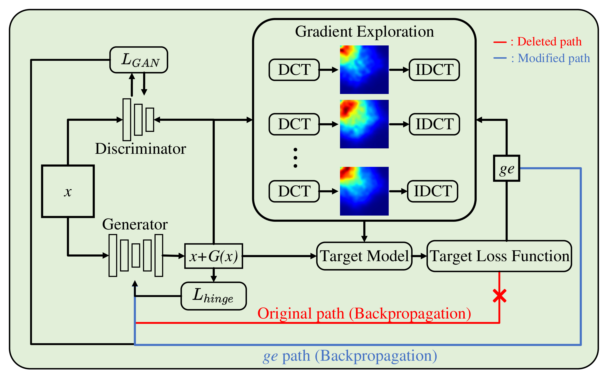

<div align="center">

# GE-AdvGAN: Gradient Editing-based Adversarial Generative Model

[](https://arxiv.org/abs/2401.06031)
[](https://opensource.org/licenses/MIT)
[](https://www.siam.org/conferences/cm/conference/sdm24)
</div>

<table align="center">
  <tr>
    <td align="center"> 
       
      <br>
      <em style="font-size: 18px;">  <strong style="font-size: 18px;">Figure 1:</strong>GE-AdvGAN Schematic Diagram</em>
    </td>
  </tr>
</table>

This repository contains the official implementation of the GE-AdvGAN, as presented in the paper [GE-AdvGAN: Gradient Editing-based Adversarial Generative Model](https://arxiv.org/abs/2401.06031). The GE-AdvGAN framework is designed to enhance the transferability of adversarial examples through a novel approach that involves editing gradients within an adversarial generative model context.


## Installation Requirements

Before running the experiments, ensure that your environment meets the following prerequisites:

- Python version: 3.8
- PyTorch version: 1.8
- Pretrainedmodels: 0.7
- NumPy version: 1.19
- Pandas version: 1.2

Please install the required libraries using `pip` or a similar package manager to meet the above specifications.

## Models

The pretrained models necessary for running the experiments can be downloaded from the following link:

[Download Pretrained Models](https://drive.google.com/file/d/1t0eNl5cgySR8Dg5Fpq04mWuoiY7yQEB4/view?usp=sharing)

Ensure that you place the downloaded models in the appropriate directory within your project structure.

## Running Experiments

To facilitate the execution of experiments, we provide shell scripts for both the baseline and the GE-AdvGAN experiments.

### Baseline Experiment

To run the baseline experiment, execute the following command:

```bash
sh run_baseline.sh
```

### GE-AdvGAN Experiment

To conduct the GE-AdvGAN experiment, use the following command:

```bash
sh run_GE.sh
```

You are encouraged to modify the parameters within these shell scripts to tailor the experiments to your specific requirements.

## Citing FSPS

```
@article{zhu2024ge,
  title={GE-AdvGAN: Improving the transferability of adversarial samples by gradient editing-based adversarial generative model},
  author={Zhu, Zhiyu and Chen, Huaming and Wang, Xinyi and Zhang, Jiayu and Jin, Zhibo and Choo, Kim-Kwang Raymond},
  journal={arXiv preprint arXiv:2401.06031},
  year={2024}
}
```

## Reference

Code refer to: [advGAN_pytorch](https://github.com/mathcbc/advGAN_pytorch.git)

